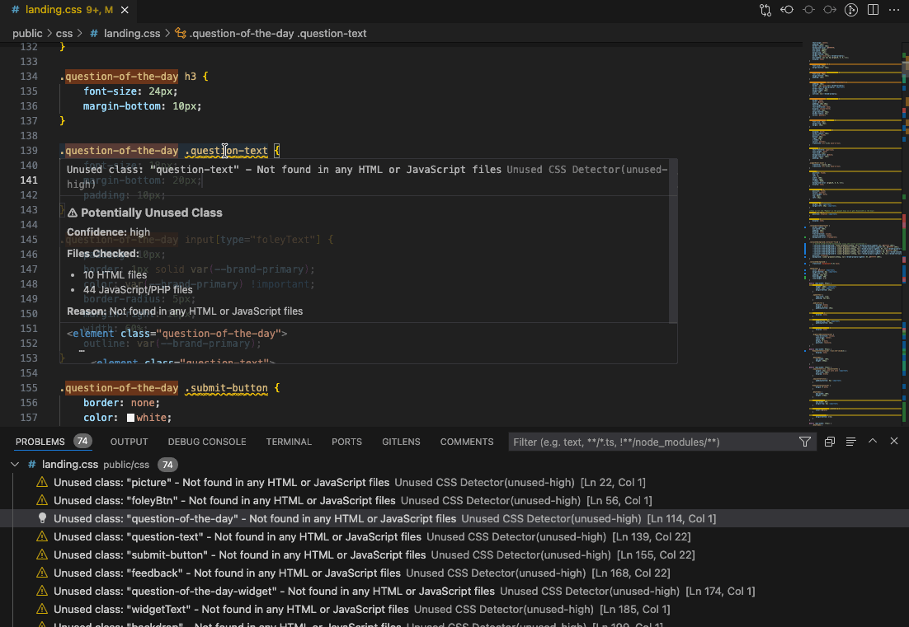

# Unused CSS Detector

> Find and remove unused CSS by intelligently scanning HTML files that link to your CSS and their associated JavaScript files.


**Stop wasting time manually hunting for unused CSS.** This extension automatically finds CSS classes and IDs that aren't being used anywhere in your project, helping you keep your stylesheets clean and your projects maintainable.

---

## ✨ Features

### 🔍 **Smart Detection**

-   Finds HTML files that link to your CSS via `<link>` tags
-   Discovers JavaScript files referenced from those HTML files
-   Follows ES6 `import` statements to find all related JavaScript modules
-   Checks template literals in JavaScript for dynamically generated HTML

### 🎯 **High Accuracy**

-   Detects dynamic class patterns like `btn-${type}` to avoid false positives
-   Automatically ignores utility frameworks (Bootstrap, Tailwind)
-   Skips pseudo-classes (`:hover`, `:focus`) and pseudo-elements (`::before`, `::after`)
-   Ignores hex colors (`#fff`, `#ffffff00`) and CSS values (`5rem`, `36deg`)
-   Smart regex patterns prevent false positives from URLs and property values

### 🎨 **Clean Visual Feedback**

-   Yellow wavy underlines on unused CSS (just like unused variables)
-   Hover tooltips show detailed information about why CSS is unused
-   Shows which files were checked and confidence levels
-   Non-intrusive - all notifications and outputs are optional

### 📊 **Multiple View Options**

-   **Problems Panel**: Native VS Code integration (⚠️ icon in status bar)
-   **Output Channel**: Detailed scan logs (optional)
-   **HTML Report**: Beautiful web-based report with full details (optional)
-   **Inline Highlights**: See issues directly in your editor

### 🛡️ **Safe & Configurable**

-   Preview before removing anything
-   Optional automatic backups
-   High/medium confidence levels
-   Fully customizable ignore patterns
-   All features are opt-in for a clean experience

### ⚙️ **Framework Support**

-   **CSS Preprocessors**: CSS, SCSS, Sass, Less
-   **JavaScript**: Vanilla JS, ES6 modules, TypeScript
-   **Frameworks**: Bootstrap 4 & 5, Tailwind CSS (auto-ignored)
-   **Template Engines**: PHP, EJS, Handlebars, and more
-   **UI Libraries**: React (JSX/TSX), Vue, Angular, Svelte

---

## 📸 Screenshots

### Yellow Underlines in Action


_Unused CSS highlighted with yellow wavy underlines - clean and non-intrusive_

### Report Feature


_See all unused CSS in a nice report view_

### Hover for Details


_Hover over any underlined CSS to see why it's unused and what files were checked_

### Settings


_Customize the settings to your liking to get the most out of this tool_

---

## 🚀 Quick Start

1. **Open any CSS file** (`.css`, `.scss`, `.sass`, or `.less`)
2. **Press** `Cmd+Shift+P` (Mac) or `Ctrl+Shift+P` (Windows/Linux)
3. **Type** "CSS: Find Unused CSS in Current File"
4. **View** yellow underlines on unused CSS
5. **Check** the Problems panel (⚠️ icon) for full details

That's it! No configuration needed.

---

## 🎯 How It Works

### The Smart Scanning Process

```
1. Analyze CSS File
   ↓
2. Find HTML files that <link> to this CSS
   ↓
3. Find <script> tags in those HTML files
   ↓
4. Follow import statements in JavaScript
   ↓
5. Search for class/ID usage in all files
   ↓
6. Report unused CSS with confidence levels
```

### What Gets Checked

**✅ CSS Files:**

-   `.css` - Regular stylesheets
-   `.scss` - Sass files
-   `.sass` - Sass (indented syntax)
-   `.less` - Less files

**✅ Source Files:**

-   `.html`, `.htm` - HTML pages
-   `.js`, `.mjs` - JavaScript
-   `.jsx`, `.tsx` - React components
-   `.ts` - TypeScript
-   `.php` - PHP templates

**✅ Detection Patterns:**

```javascript
// HTML
<div class="my-class"></div>

// JavaScript - classList
element.classList.add('my-class')

// JavaScript - className
element.className = 'my-class'

// JavaScript - querySelector
document.querySelector('.my-class')

// React/JSX
<div className="my-class" />

// Template literals
const html = `<div class="my-class"></div>`

// PHP
<div class="<?php echo $class ?>">
```

### What Gets Ignored (Smart Filtering)

**❌ Automatically Skipped:**

-   Hex colors: `#fff`, `#ffffff`, `#ffffff00`
-   CSS units: `5rem`, `36deg`, `2s`, `100px`
-   Bootstrap classes: `.btn-primary`, `.col-md-6`
-   Tailwind classes: `.flex`, `.px-4`, `.hover:bg-blue-500`
-   Dynamic patterns: If `btn-${type}` is detected, all `btn-*` classes are skipped

---

## 📋 Commands

| Command                                    | Description                         |
| ------------------------------------------ | ----------------------------------- |
| **CSS: Find Unused CSS in Current File**   | Scan the currently open CSS file    |
| **CSS: Find Unused CSS in Entire Project** | Scan all CSS files in the project   |
| **CSS: Remove Unused CSS (Preview First)** | Preview and select what to remove   |
| **CSS: Remove High-Confidence Unused CSS** | Automatically remove safe deletions |
| **CSS: Show Unused CSS Report**            | View detailed HTML report           |
| **CSS: Clear Cache**                       | Clear the scan cache                |

---

## ⚙️ Configuration

All settings are **optional** and **off by default** for a clean, non-intrusive experience.

### Basic Settings

```json
{
	// Show/hide features (all default to false for clean experience)
	"unusedCssDetector.showProblemsPanel": true, // Show in Problems panel
	"unusedCssDetector.showNotification": false, // Show popup notifications
	"unusedCssDetector.showOutputChannel": false, // Show output logs
	"unusedCssDetector.showReportPanel": false, // Auto-show HTML report
	"unusedCssDetector.autoScanOnSave": false, // Scan when you save CSS

	// Scanning behavior
	"unusedCssDetector.scanMode": "linked-files-only", // or "all-project-files"
	"unusedCssDetector.fallbackToAllFiles": true, // Scan all if no links found

	// File types
	"unusedCssDetector.scanFileTypes": ["html", "htm", "js", "jsx", "ts", "tsx", "php", "mjs"],
	"unusedCssDetector.cssFileTypes": ["css", "scss", "sass", "less"],

	// Framework support
	"unusedCssDetector.tailwindSupport": true, // Ignore Tailwind classes
	"unusedCssDetector.ignoreUtilityFrameworks": true, // Ignore Bootstrap/Tailwind
	"unusedCssDetector.ignorePrefixes": ["wp-", "bs-"], // Custom prefixes to ignore

	// Advanced
	"unusedCssDetector.detectDynamicPatterns": true, // Detect btn-${type} patterns
	"unusedCssDetector.createBackup": false, // Backup before removal
	"unusedCssDetector.problemSeverity": "warning", // error/warning/info/hint

	// Exclusions
	"unusedCssDetector.excludePaths": ["**/node_modules/**", "**/dist/**", "**/build/**", "**/*.min.css", "**/*.min.js"]
}
```

### Recommended Configurations

**Minimal (Default):**

```json
{
	"unusedCssDetector.showProblemsPanel": true
}
```

_Only shows issues in Problems panel - clean and simple_

**Active Development:**

```json
{
	"unusedCssDetector.showProblemsPanel": true,
	"unusedCssDetector.autoScanOnSave": true
}
```

_Automatically scans when you save CSS files_

**Full Featured:**

```json
{
	"unusedCssDetector.showProblemsPanel": true,
	"unusedCssDetector.showNotification": true,
	"unusedCssDetector.showOutputChannel": true,
	"unusedCssDetector.showReportPanel": true
}
```

_All features enabled_

---

## 💡 Use Cases

### ✅ Bootstrap Projects

Automatically ignores Bootstrap utility classes while finding your unused custom CSS:

```css
.btn-primary {
} /* ✅ Ignored (Bootstrap) */
.my-custom-button {
} /* ❌ Checked */
```

### ✅ Tailwind Projects

Recognizes all Tailwind patterns including responsive and state variants:

```css
.flex {
} /* ✅ Ignored */
.hover:bg-blue-500 {
} /* ✅ Ignored */
.md:text-center {
} /* ✅ Ignored */
.my-custom-component {
} /* ❌ Checked */
```

### ✅ React/JSX Applications

Finds classes in JSX `className` attributes and template literals:

```jsx
<div className='my-component' />; // ✅ Found
const html = `<div class="my-class"></div>`; // ✅ Found
```

### ✅ PHP/WordPress Sites

Scans PHP files and follows WordPress conventions:

```php
<div class="<?php echo $class ?>">  // ✅ Scanned
```

### ✅ Component-Based Architecture

Follows ES6 imports to find classes in separate component files:

```javascript
import { Header } from './components/header.js'; // ✅ Followed and scanned
```

---

## 🎨 Example Output

### In Problems Panel:

```
⚠️ Unused class: "old-button" - Not found in any HTML or JavaScript files
   Checked 5 HTML files and 8 JavaScript files

⚠️ Unused class: "legacy-nav" - Not found in any HTML or JavaScript files
   Checked 5 HTML files and 8 JavaScript files
```

### In Output Channel:

```
============================================================
Unused CSS Detector - Scan Started
============================================================

Found 156 selectors in CSS file
Found 5 HTML files linking to styles.css
Found 8 JavaScript files

📊 Scan Complete
------------------------------------------------------------
CSS File: styles.css

🔍 Files Checked:
   HTML files: 5 (index.html, about.html, contact.html...)
   JavaScript/PHP files: 8 (main.js, header.js, app.js...)

📈 Results:
   Total CSS classes/IDs: 156
   Used: 142 ✅
   Unused (High Confidence): 12 ❌
   Unused (Medium Confidence): 2 ⚠️
   Skipped (Pseudo-classes, etc.): 47 ⏭️

💾 Potential Space Savings: ~48 lines
```

---

## 🔧 Troubleshooting

### Issue: CSS classes in JavaScript aren't being detected

**Solution:** Make sure the JavaScript files are linked from your HTML:

```html
<script src="path/to/your/script.js"></script>
```

Or if using ES6 modules, they should be imported from a file that IS linked.

---

### Issue: Getting too many false positives

**Solution:** Add custom ignore patterns:

```json
{
	"unusedCssDetector.ignorePrefixes": ["wp-", "js-", "my-prefix-"]
}
```

---

### Issue: Want to scan all files, not just linked ones

**Solution:** Change scan mode:

```json
{
	"unusedCssDetector.scanMode": "all-project-files"
}
```

---

### Issue: Extension is too noisy

**Solution:** All notifications are off by default. If they're showing, turn them off:

```json
{
	"unusedCssDetector.showNotification": false,
	"unusedCssDetector.showOutputChannel": false,
	"unusedCssDetector.showReportPanel": false
}
```

---

## 🆚 Why This Extension?

| Feature                              | Unused CSS Detector | Other Tools |
| ------------------------------------ | ------------------- | ----------- |
| Follows `<link>` relationships       | ✅                  | ❌          |
| Follows ES6 imports                  | ✅                  | ❌          |
| Scans template literals              | ✅                  | ❌          |
| Detects dynamic patterns             | ✅                  | ❌          |
| Framework-aware                      | ✅                  | Limited     |
| Zero false positives from CSS values | ✅                  | ❌          |
| Non-intrusive by default             | ✅                  | ❌          |
| Problems panel integration           | ✅                  | Limited     |
| Works with preprocessors             | ✅                  | Limited     |

---

## 🤝 Contributing

Found a bug or have a feature request?  
**GitHub**: https://github.com/robwizzie/unused-css-detector/issues

---

## 📝 Release Notes

### Version 1.0.0

**Initial Release**

-   ✅ Smart CSS scanning with link following
-   ✅ ES6 import statement following
-   ✅ Template literal detection
-   ✅ Bootstrap & Tailwind auto-ignore
-   ✅ Dynamic pattern detection
-   ✅ Problems panel integration
-   ✅ Support for CSS, SCSS, Sass, Less
-   ✅ Support for HTML, JS, JSX, TS, TSX, PHP
-   ✅ Yellow wavy underlines (non-intrusive)
-   ✅ Hover tooltips with details
-   ✅ High/medium confidence levels
-   ✅ Safe removal with preview
-   ✅ Optional backups
-   ✅ Configurable notifications (all off by default)
-   ✅ Hex color & CSS value filtering
-   ✅ Multi-line template literal support

---

## 📜 License

MIT License - See [LICENSE](LICENSE) file for details

---

## 🙏 Acknowledgments

Built for developers who care about clean, maintainable code.

---

**Enjoy cleaner CSS!** 🎨✨

[⬆ Back to Top](#unused-css-detector)
